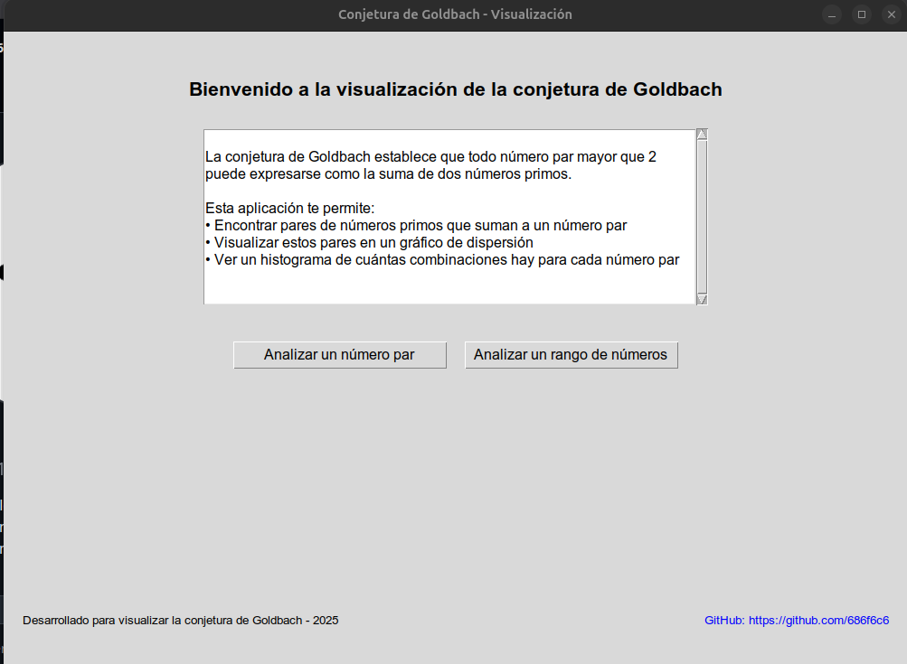
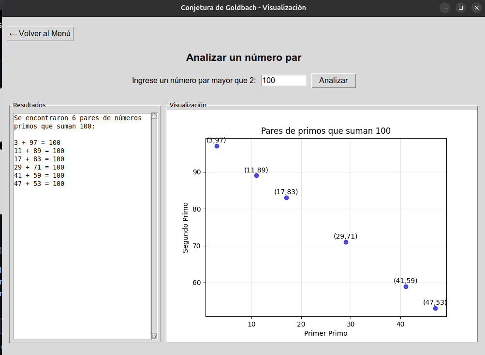
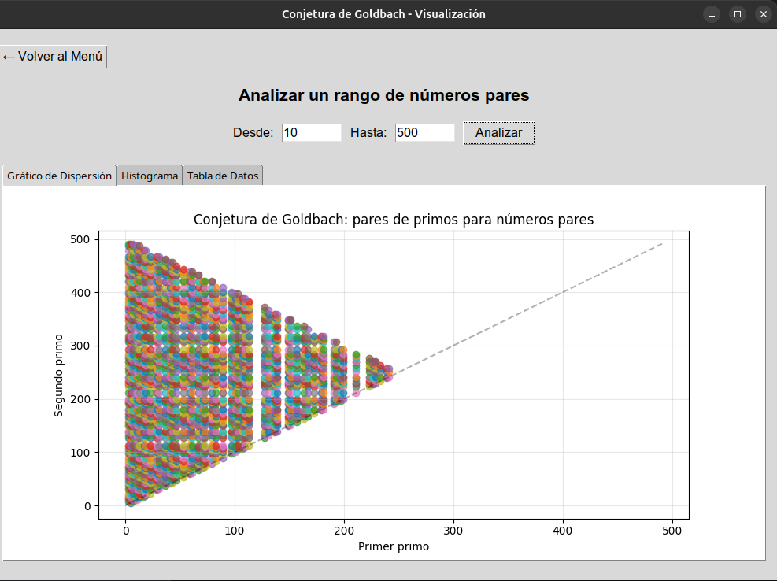
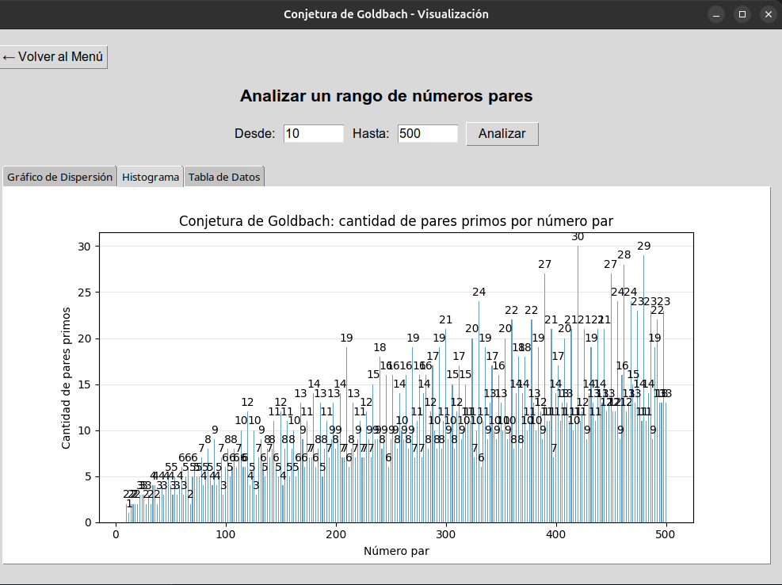

# Visualización de la Conjetura de Goldbach

Este proyecto implementa una aplicación para visualizar la Conjetura de Goldbach, que establece que todo número par mayor que 2 puede expresarse como la suma de dos números primos.



## Características

- **Análisis individual**: Encuentra todos los pares de números primos que suman a un número par específico
- **Análisis de rango**: Analiza un rango de números pares y visualiza los resultados
- **Visualizaciones**:
  - Gráfico de dispersión mostrando los pares de primos para cada número par
  - Histograma que muestra cuántas combinaciones hay para cada número par
- **Interfaz gráfica**: Menú de bienvenida personalizado y navegación intuitiva

## Estructura del Proyecto

- `main.py`: Punto de entrada principal con la interfaz gráfica y menú de bienvenida
- `prime_utils.py`: Funciones de utilidad para trabajar con números primos
- `goldbach.py`: Implementación de la lógica de la Conjetura de Goldbach
- `visualization.py`: Funciones para crear visualizaciones (gráficos de dispersión e histogramas)

## Requisitos

- Python 3.6 o superior
- Bibliotecas:
  - matplotlib
  - numpy
  - tkinter (incluido en la mayoría de instalaciones de Python)

## Instalación

1. Asegúrese de tener Python instalado
2. Instale las dependencias:
   ```
   pip install matplotlib numpy
   ```

## Uso

Ejecute el script de inicio:

```
./run.sh
```

O manualmente con Python:

```
python main.py
```

Esto abrirá la interfaz gráfica con el menú de bienvenida, desde donde podrá:

### Analizar un número par específico

Permite encontrar todos los pares de números primos que suman a un número par dado.



### Analizar un rango de números pares

Genera visualizaciones para un rango de números pares, incluyendo gráficos de dispersión y histogramas.



### Visualización de histograma

Muestra la cantidad de combinaciones de pares primos para cada número par en el rango seleccionado.



## Sobre la Conjetura de Goldbach

La Conjetura de Goldbach es uno de los problemas no resueltos más antiguos en la teoría de números. Fue propuesta por Christian Goldbach en 1742 y establece que todo número entero par mayor que 2 puede expresarse como la suma de dos números primos.

Aunque ha sido verificada computacionalmente para números muy grandes, aún no se ha encontrado una demostración matemática completa.

## Autor

[GitHub: https://github.com/686f6c6](https://github.com/686f6c6)
